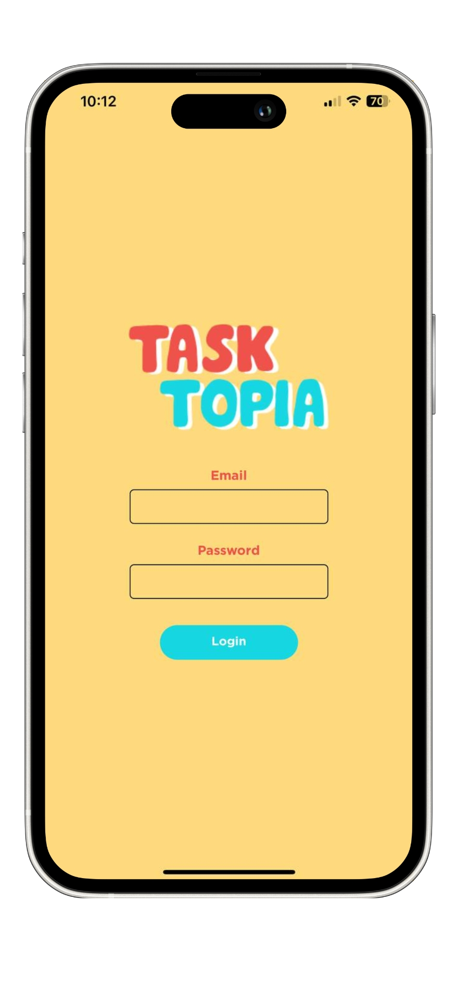
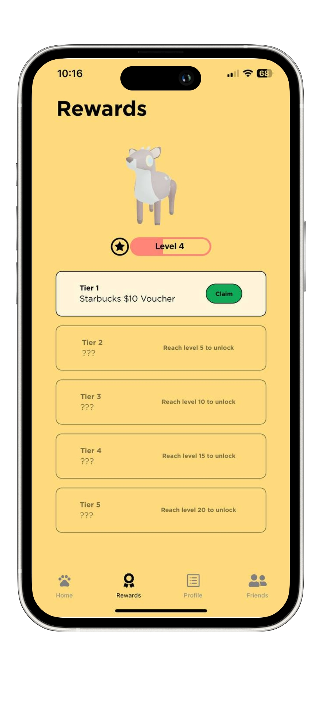
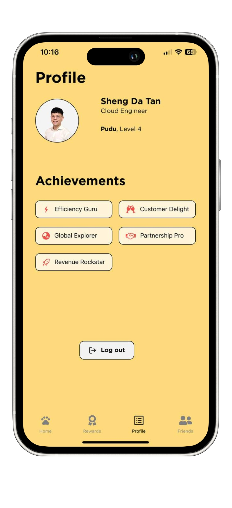
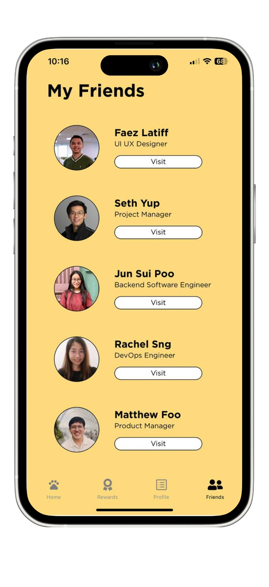
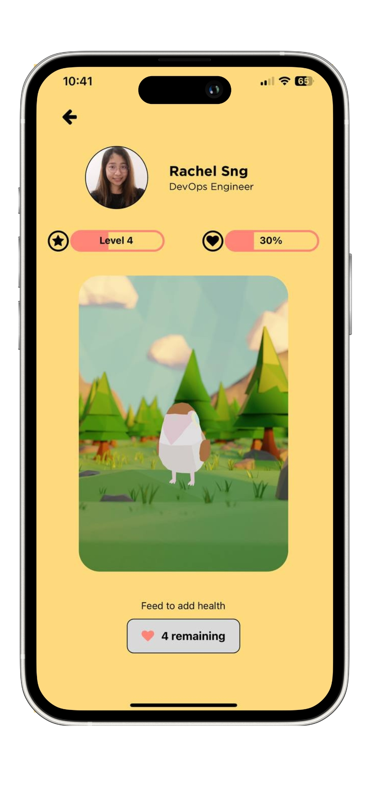

<!-- TABLE OF CONTENTS -->
## Table of Contents
  <ol>
    <li>
      <a href="#about-the-project">About The Project</a>
      <ul>
        <li><a href="#built-with">Built With</a></li>
        <li><a href="#team-members">Team Members</a></li>
      </ul>
    </li>
    <li><a href='#showcase'>Showcase</a></li>
  </ol>

 
 

## About The Project

    

   Tasktopia is an innovative app that promotes employee engagement and productivity through interactive virtual pets. Users care for their pets, complete tasks assigned by supervisors, and earn real-world rewards. With its gamified approach, Tasktopia enhances teamwork and satisfaction, creating a thriving workplace community.

### Built With

* 
* 
* 

 

### Team Members

| Members               | School Email     | Email                           |
| --------------------- | ---------------- | ------------------------------- |
| Tan Sheng Da                   | shengda.tan.2021 | shengdatan@gmail.com            |
| Sng Yue Wei, Rachel            | rachel.sng.2021  | rrachelsng@gmail.com    |
| Adam Tan          | adam.tan.2021  |  adamft.2021@scis.smu.edu.sg   |
| Poo Jun Sui            | junsui.poo.2021  | junsui.poo.2021@scis.smu.edu.sg   |

 

### Showcase

  
  

  
  

  
  

